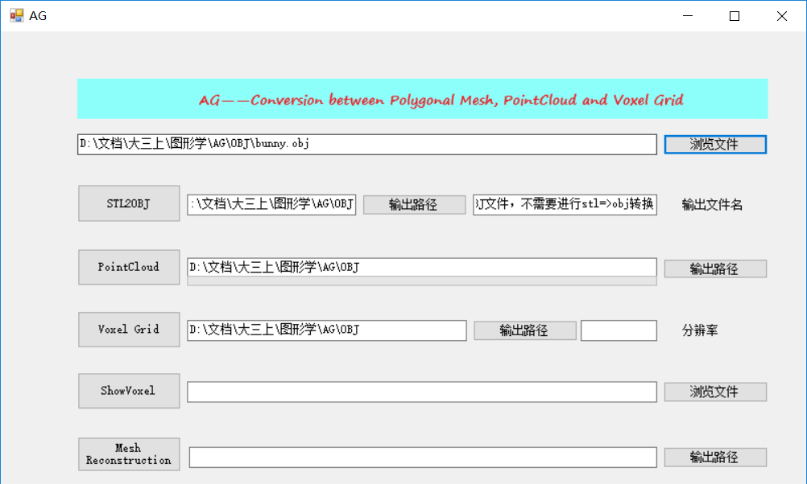
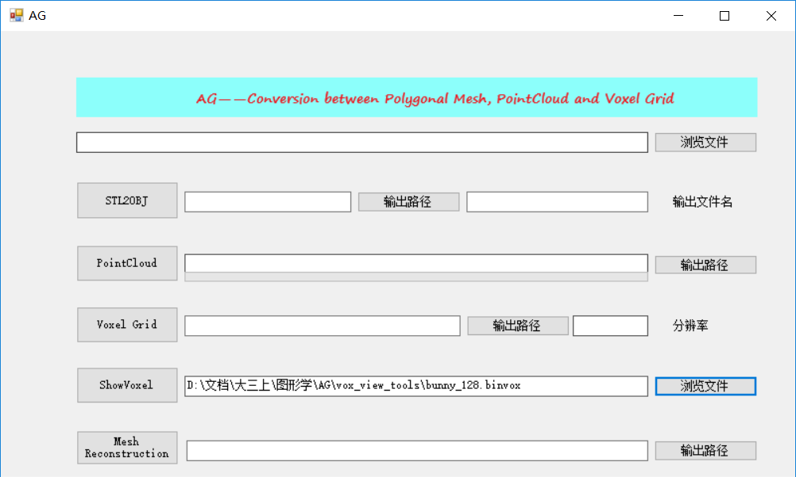
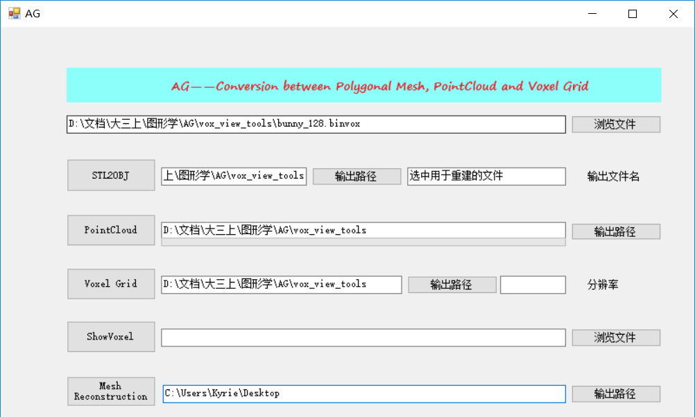

## GUI使用说明

点击蓝色高亮选项浏览文件，所有的输出路径须为文件夹，输出文件将与输入文件名相同（仅改变文件格式）。

- 选择stl文件后修改输出文件名及输出路径选用STL2OBJ选项进行转换，以便使用后续功能，若选择obj文件后输出文件名栏会提醒无需进行转换；
- obj文件可选择点云化PointCloud功能，输出路径栏下方进度条显示转化进度；
- obj文件可选择Voxel Grid功能进行体素化，选择输出路径和分辨率，生成后自动预览；

ShowVoxel选项将显示右侧文件选项中的binvox文件。

最上方选择体素化binvox或点云pcd文件后，可在下方Mesh Reconstruction处设置输出路径，进行表面重建。

为使用便利，很多参数的设置均采用默认设置，此GUI仅用作课程demo的一部分