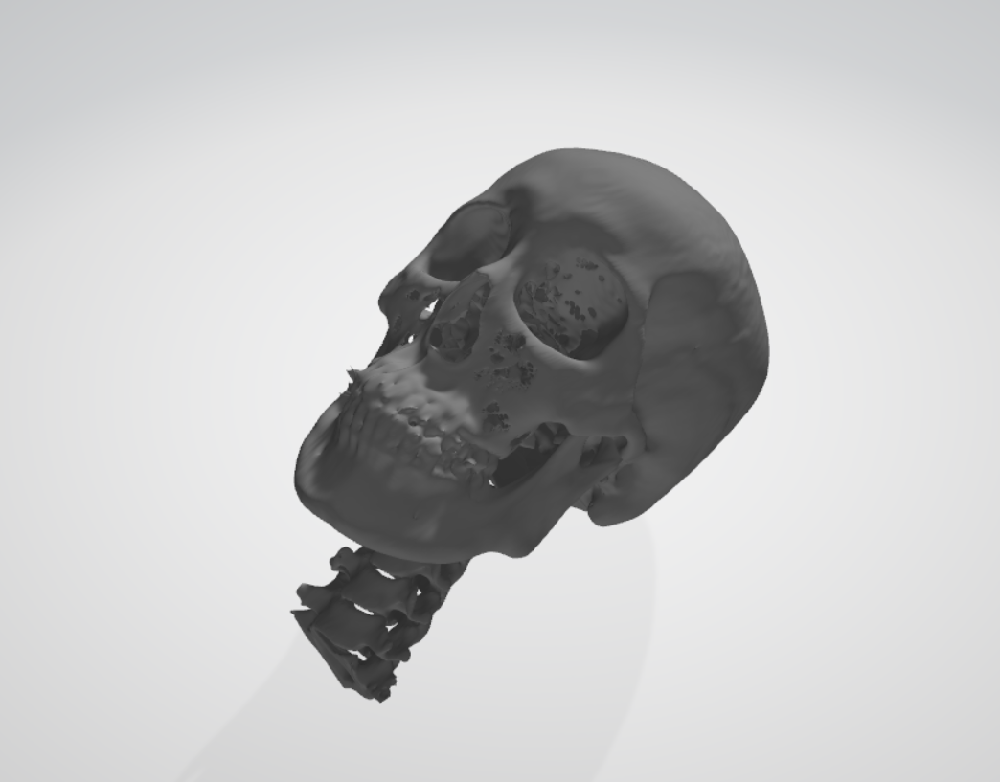

# Voxel-World-Master
this is a toy voxelizer and unvoxelizer project for CS337 CG 

- Learn from [kctess5's](https://github.com/kctess5/voxelizer) voxelizer at the beginning, and voxelization is based on his framework. 

- Rewirte another voxelizing algorithm using cuda.

- Implement marching cube algorithm in a easy, special but effective way to unvoxelize .binvox into .ply, which supports .pcd to .ply at the same time. Also accelerate it.

- GUI.

  

---

**original .obj** 

**.obj -> .binvox**

**.binvox -> .ply**

